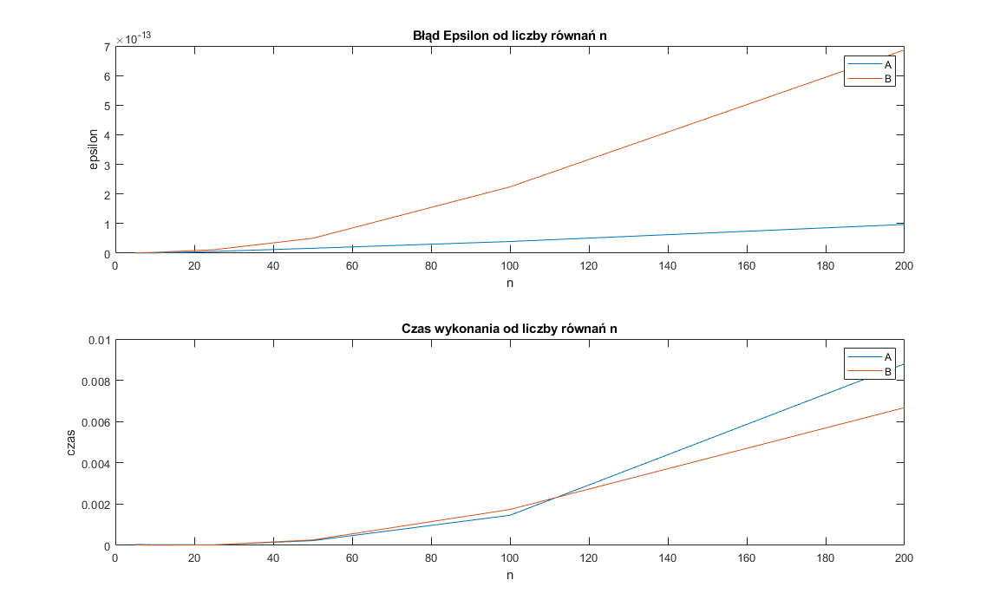

# Metody Numeryczne - Projekt I
```s
student: Bartłomiej Krawczyk
indeks: 310774
```

<!-- https://snip.mathpix.com/2barti2/notes/f1b9f837-1234-4295-99ed-258c7a7ed446/edit -->

# Dane

### A):
$$
\begin{equation}
  a_{ij} = \begin{cases}
    -10, & \text{dla $j = i$} \\
    3, & \text{dla $j = i - 1$ lub $j = i + 1$} \\
    0, & \text{dla pozostałych}
  \end{cases}
\end{equation}
$$

$$
\begin{equation}
  b_{ij} = 2.5 - 0.5i
\end{equation}
$$

**Funkcja generująca macierz A oraz wektor b:**

```matlab
function [A,b] = prepareParametersA(n)
    A = zeros(n, n);
    b = zeros(n, 1);

    for i = 1 : n
        A(i, i) = -10;
        b(i, 1) = 2.5 - 0.5 * i;
    end
    
    for i = 2 : n
        A(i, i - 1) = 3;
        A(i - 1, i) = 3;
    end
end
```

Przykładowa macierz $A$ dla $n = 5$:
```s
   -10     3     0     0     0
     3   -10     3     0     0
     0     3   -10     3     0
     0     0     3   -10     3
     0     0     0     3   -10
```

Przykładowy wektor $b$ dla $n = 5$:
```s
    2.0000
    1.5000
    1.0000
    0.5000
         0
```

### B):
$$
\begin{equation}
  a_{ij} = \begin{cases}
    4n^2 + (2i + 3) n, & \text{dla $j = i$} \\
    2 (i + j) + 1, & \text{dla $j \neq i $} \\
  \end{cases}
\end{equation}
$$

$$
\begin{equation}
  b_{ij} = 2.5 + 0.6i
\end{equation}
$$

**Funkcja generująca macierz A oraz wektor b:**

```matlab
function [A,b] = prepareParametersB(n)
    A = zeros(n, n);
    b = zeros(n, 1);

    for i = 1 : n
        for j = 1 : n
            A(i, j) = 2 * (i + j) + 1;
        end
    end
    
    for i = 1 : n
        A(i, i) = 4 * n ^ 2 + (2 * i + 3) * n;
        b(i, 1) = 2.5 + 0.6 * i;
    end
end
```

Przykładowa macierz $A$ dla $n = 5$:
```s
   125     7     9    11    13
     7   135    11    13    15
     9    11   145    15    17
    11    13    15   155    19
    13    15    17    19   165
```

Przykładowy wektor $b$ dla $n = 5$:
```s
    3.1000
    3.7000
    4.3000
    4.9000
    5.5000
```

# Zadanie 1

## Treść

Napisać uniwersalną procedurę w Matlabie o odpowiednich parametrach wejścia i wyjścia (solwer), rozwiązującą układ $n$ równań liniowych $Ax = b$, wykorzystując podaną metodę.

> Nie sprawdzać w procedurze, czy dana macierz $A$ spełnia wymagania stosowalności metody.

Obliczyć błąd rozwiązania $\varepsilon = ∥A\tilde{x} − b∥_2$ (skorzystać z funkcji `norm` Matlaba).

Proszę zastosować następnie swoją procedurę w programie do rozwiązania obydwu (jeśli można) lub jednego z układów równań dla podanych niżej macierzy $A$ i wektorów $b$, przyjmując: $n = 5, 10, 25, 50, 100, 200$.

Metoda: faktoryzacji $LDL^T$

Proszę wykonać wykres (wykresy) zależności błędu $\varepsilon$ od liczby równań $n$.

## Rozwiązanie

**Solver równania $Ax = b$**

Wyznaczenie wyniku na podstawie rozwiązania układów równań z macierzami trójkątnymi:

$$
Ax = LDL^T x = L(DL^T x) = b
$$

$$
y = DL^T x
$$

$$
Ax = Ly = b
$$

gdzie macierze $L$ i $DL^T$ są macierzami trójkątnymi


Program:
```matlab
function x = solveUsingLDLtDecomposition(A, b)
        % A = LDL'
        [L, D] = LDLtDecomposition(A);
        % First solve equation Ly = b for y
        % L - lower triangular matrix
        y = solveLinearEquationWithLowerTriangularMatrix(L, b);
        % Then solve equation DL' x = y for x
        % DL' - upper triangular matrix
        x = solveLinearEquationWithUpperTriangularMatrix(D * L', y);
end
```

**Metoda faktoryzacji $LDL^T$**

Algorytm faktoryzacji najłatwiej osiągnąć poprzez przedstawienie macierzy $A$ jako iloczyn macierzy $L$ oraz $DL^T$. Kolejno rozwiązując równania skalarne jesteśmy w stanie przedstawić to działanie w postaci algorytmu.

Algorytm:

$$
d_{ii} = a_{ii} - \sum_{k = 1}^{i-1} {\overline{l}_{ik}^2 d_{kk}}
$$

$$
\overline{l}_{ji} = ({a_{ji} -  \sum_{k=1}^{i-1} {\overline{l}_{jk} d_{kk} \overline{l}_{ik}}}) / d_{ii}, i = 1, ..., n, j = i + 1, ..., n
$$

Program:
```matlab
function [L, D] = LDLtDecomposition(A)
    [n, ~] = size(A);
    L = zeros(n, n);
    D = zeros(n, n);
    
    for i = 1 : n
        L(i, i) = 1;
        D(i, i) = A(i, i);

        for k = 1 : i - 1
            D(i, i) = D(i, i) - L(i, k) ^ 2 * D(k, k);
        end
        
        for j = i + 1 : n
            L(j, i) = A(j, i);
            for k = 1 : i - 1
                L(j, i) = L(j, i) - L(j, k) * D(k, k) * L(i, k);
            end
            L(j, i) = L(j, i) / D(i, i);
        end
    end
end
```

**Rozwiązywanie układu równań $Ax = b$ z macierzą trójkątną dolną**

Kolejno rozwiązujemy po jednym układzie równań z jedną niewiadomą. Za każdym razem wyliczamy po jednej zmiennej i w kolejnych krokach podstawiamy wyliczone wartości do reszty równań, aby także mieć równanie z jedną niewiadomą.

Algorytm:

$$
x_1 = \frac{b_1}{a_{11}}
$$

$$
x_k = \frac{b_k - \sum_{j = 1}^{k - 1} {a_{kj} x_j}}{a_{kk}}, k = 2, 3, ..., n
$$

Program w matlab:

```matlab
function x = solveLinearEquationWithLowerTriangularMatrix(A, b)
    [n, ~] = size(A);
    x = zeros(n, 1);

    for k = 1 : n
        x(k, 1) = b(k, 1);
        
        for j = 1 : k - 1
            x(k, 1) = x(k, 1) - A(k, j) * x(j, 1);
        end

        x(k, 1) = x(k, 1) / A(k, k);
    end
end
```
**Rozwiązywanie układu równań $Ax = b$ z macierzą trójkątną górną**

Algorytm:

$$
x_n = \frac{b_n}{a_{nn}}
$$

$$
x_k = \frac{b_k - \sum_{j = k + 1}^{n} {a_{kj} x_j}}{a_{kk}}, k = n - 1, n - 2, ..., 1
$$

Program w matlab:

```matlab
function x = solveLinearEquationWithUpperTriangularMatrix(A, b)
    [n, ~] = size(A);
    x = zeros(n, 1);
    
    for k = n : -1 : 1
        x(k, 1) = b(k, 1);
        
        for j = k + 1 : n
            x(k, 1) = x(k, 1) - A(k, j) * x(j, 1);
        end

        x(k, 1) = x(k, 1) / A(k, k);
    end
end
```

## Wykres



Program:

```matlab
function plot_1_1()
    sizes = [5 10 25 50 100 200];

    epsilonsA = zeros(size(sizes));
    timesA = epsilonsA;
    epsilonsB = epsilonsA;
    timesB = epsilonsA;

    i = 1;
    for n = sizes
        [A, b] = prepareParametersA(n);
        [epsilonsA(i), timesA(i)] = solveAndCalculateEpsilon(A, b);
        [A, b] = prepareParametersB(n);
        [epsilonsB(i), timesB(i)] = solveAndCalculateEpsilon(A, b);
        i = i + 1;
    end

    tiledlayout(2, 1);
    
    nexttile
    plot(sizes, epsilonsA, sizes, epsilonsB);
    title('Błąd Epsilon od liczby równań n');
    xlabel('n');
    ylabel('epsilon');
    legend('A', 'B');

    nexttile
    plot(sizes, timesA, sizes, timesB);
    title('Czas wykonania od liczby równań n');
    xlabel('n');
    ylabel('czas');
    legend('A', 'B');
end

function [epsilon, time] = solveAndCalculateEpsilon(A, b)
    tic
    x = solveUsingLDLtDecomposition(A, b);
    time = toc;
    epsilon = norm(A * x - b, 2);
end
```

## Wnioski:

Wykorzystanie faktoryzacji $LDL^T$ do rozwiązania układów równań sprawdziło się całkiem nieźle. Błąd $\varepsilon = ∥A\tilde{x} − b∥_2$ nawet dla bardzo dużych układów równań nie przekroczył poziomu $10^{-12}$. Błąd przy coraz to większych macierzach wydaje się rosnąć liniowo.

Obie testowane macierze są symetryczne, także można było zastosować faktoryzację $LDL^T$.

# Zadanie 2

## Treść

Napisać uniwersalną procedurę w Matlabie o odpowiednich parametrach wejścia i wyjścia, rozwiązującą układ $n$ równań liniowych $Ax = b$, wykorzystując metodę **iteracyjną Jacobiego**.

> Nie sprawdzać w procedurze, czy dana macierz $A$ spełnia wymagania stosowalności metody.

Jej parametry wejściowe powinny zawierać m.in. wartość graniczną $\delta$ błędu między kolejnymi przybliżeniami rozwiązania, liczonego jako **norma euklidesowa z ich różnicy** (skorzystać z funkcji `norm` Matlaba). Przyjąć jako kryterium stopu warunek: δ = 10−8 ≜ 1e − 8.

$$
\delta = 10^{-8} \triangleq 1e-8
$$

Proszę zastosować tę procedurę do rozwiązania właściwego układu równań spośród przedstawionych poniżej dla $n = 5, 10, 25, 50, 100, 200$.

Proszę sprawdzić dokładność rozwiązania licząc także błąd $\varepsilon$ i dla każdego układu równań wykonać rysunek zależności tego błędu od liczby równań $n$. Jeśli był rozwiązywany ten sam układ równań, co w p. 1, proszę porównać czasy obliczeń dla różnych algorytmów i wymiarów zadań.

## Rozwiązanie

**Dekompozycja A = L + D + U**

- L - elementy macierzy A pod diagonalą, zera dla pozostałych
- D - elementy macierzy A na diagonali, zera dla pozostałych
- U - elementy macierzy A nad diagonalą, zera dla pozostałych

```matlab
function [L, D, U] = LDUDecomposition(A)
    % L = tril(A, -1);
    % D = diag(diag(A));
    % U = triu(A, 1);

    [n, ~] = size(A);

    L = zeros(n, n);
    D = zeros(n, n);
    U = zeros(n, n);

    for i = 1 : n
        D(i, i) = A(i, i);
        L(i, 1 : i - 1) = A(i, 1 : i - 1);
        U(i, n: -1 : i + 1) = A(i, n : -1 : i + 1);
    end
end
```

**Metoda iteracyjna Jacobiego:**

$$
A = L + D + U
$$

Jesteśmy w stanie zapisać równanie $Ax = b$ w postaci:

$$
Dx = -(L + U)x + b
$$

Z czego wynikła **metoda Jacobiego**:

$$
Dx^{(i + 1)} = -(L + U)x^{(i)} + b, i = 0, 1, 2, ...
$$

Algorytm:

$$
x_j^{(i+1)} = - \frac{1}{d_{jj}} (\sum_{k = 1}^{n}{(l_{jk} + u_{jk})x_k^{(i)} - b_j}), j = 1,2, ..., n
$$

Program:

```matlab
function x = solveUsingJacobiMethod(A, b, delta)
    [n, ~] = size(A);

    [L, D, U] = LDUDecomposition(A);

    % assume x0 consists of zeros
    x1 = b ./ diag(D);
    x2 = calculateNextX(L, D, U, b, n, x1);

    while norm(x1 - x2, 2) >= delta
        x1 = x2;
        x2 = calculateNextX(L, D, U, b, n, x1);
    end

    x = x2;
end

function x2 = calculateNextX(L, D, U, b, n, x1)
    x2 = zeros(n, 1);

    for j = 1 : n

        for k = 1 : n
            x2(j, 1) = x2(j, 1) + (L(j, k) + U(j, k)) * x1(k, 1);
        end
        
        x2(j, 1) = - (x2(j, 1) - b(j, 1)) / D(j, j);
    end
end
```

## Wykres


```matlab
function plot_1_2()
    sizes = [5 10 25 50 100 200];

    epsilonsA = zeros(size(sizes));
    timesA = epsilonsA;
    epsilonsB = epsilonsA;
    timesB = epsilonsA;

    i = 1;
    for n = sizes
        [A, b] = prepareParametersA(n);
        [epsilonsA(i), timesA(i)] = solveAndCalculateEpsilon(A, b);
        [A, b] = prepareParametersB(n);
        [epsilonsB(i), timesB(i)] = solveAndCalculateEpsilon(A, b);
        i = i + 1;
    end

    tiledlayout(3, 1);
    
    nexttile
    plot(sizes, epsilonsA, sizes, epsilonsB);
    title('Błąd Epsilon od liczby równań n');
    xlabel('n');
    ylabel('epsilon');
    legend('A', 'B');

    nexttile
    plot(sizes, epsilonsA);
    title('Błąd Epsilon od liczby równań n');
    xlabel('n');
    ylabel('epsilon');
    legend('A');

    nexttile
    plot(sizes, timesA, sizes, timesB);
    title('Czas wykonania od liczby równań n');
    xlabel('n');
    ylabel('czas');
    legend('A', 'B');
end

function [epsilon, time] = solveAndCalculateEpsilon(A, b)
        delta = 1e-8;
        tic
        x = solveUsingJacobiMethod(A, b, delta);
        time = toc;
        epsilon = norm(A * x - b, 2);
end
```

## Wnioski:

W przypadku obu macierzy A) oraz B) występuje silna diagonalna dominacja. Wynika z tego, że można zastosować metodę Jacobiego do obu układów równań - metoda będzie zbieżna.

Wyniki z wykorzystaniem metody Jacobiego są gorsze niż w przypadku metody z faktoryzacją $LDL^T$. Błąd w przypadku A) oraz B) jest o kilka rzędów wielkości większy. W przypadku A) maksymalny błąd jest rzędu $10^{-7}$, a w przypadku B) jest rzędu $10^{-3}$.

Ponadto błąd rozwiązania w przypadku A) nie rośnie proporcjonalnie do ilości równań, a zdaje się zachowywać chaotycznie. Podejrzewam, że wynika to z zadanego warunku stop $10^{-8}$. Gdy osiągamy zadaną dokładność algorytm przerywa i w każdym przypadku może to zrobić w innej iteracji.

Czas wyliczeń w przypadku B) jest na korzyść rozwiązania metodą iteracyjną, a w przypadku A) jest dokładnie na odwrót.

# Zadanie 3

## Treść

Dla podanych w tabeli danych pomiarowych (próbek) **metodą najmniejszych kwadratów** należy wyznaczyć funkcję wielomianową y = f(x) (tzn. wektor współczynników) najlepiej aproksymującą te dane.

| $x_i$ | $y_i$   |
|-------|---------|
| -10   | -42.417 |
| -8    | -23.440 |
| -6    | -11.160 |
| -4    | -4.128  |
| -2    | -0.725  |
| 0     | 0.942   |
| 2     | -2.069  |
| 4     | -3.908  |
| 6     | -4.705  |
| 8     | -5.438  |
| 10    | -3.578  |

Proszę przetestować wielomiany stopni: $3, 5, 7, 9, 10$. Kod aproksymujący powinien być uniwersalną procedurą w Matlabie o odpowiednich parametrach wejścia i wyjścia.

W sprawozdaniu proszę przedstawić na rysunku otrzymaną funkcję na tle danych (funkcję aproksymującą proszę próbkować przynajmniej 10 razy częściej niż dane).

Do rozwiązania zadania najmniejszych kwadratów proszę wykorzystać najpierw **układ równań normalnych**, a potem **rozkład SVD**.

Do rozwiązywania układu równań i dekompozycji użyć solwerów Matlaba. Porównać efektywność obydwu podejść.

Do liczenia wartości wielomianu użyć funkcji `polyval`.

Proszę obliczyć błąd aproksymacji w dwóch normach: euklidesowej oraz maksimum (nieskończoność). W obydwu przypadkach skorzystać z funkcji `norm` Matlaba.


## Ogólny start rozwiązania

Postać funkcji wielomianowej:
$$
f(x) = \sum_{i=0}^{n} a_i x^i
$$

Macierz z wyliczonymi wartościami stojącymi przy poszczególnych współczynnikach funkcji:
$$
A = \begin{bmatrix}
x_0^0 & x_0^1 & ... & x_0^n\\
x_1^0 & x_1^1 & ... & x_1^n\\
x_2^0 & x_2^1 & ... & x_2^n\\
... & ... & ... & ... \\
x_N^0 & x_N^1 & ... & x_N^n\\
\end{bmatrix}
$$

Wektor szukanych współczynników funkcji wielomianowej:
$$
a = [a_0 a_1 ... a_n]^T
$$

Wektor wyników:
$$
y = f(x_j), j = 0, 1, ..., N
$$

W tak zapisanym zadaniu chcemy minimalizować funkcję:

$$
H(a) = (||y - Aa||_2)^2
$$

Dalej będziemy rozwiązywać zadanie **LZNK**

$$
A a = y
$$

Program wyliczający macierz $A$:

```matlab
function A = prepareMatrixWithAppliedFunctions(x, n)
    A = zeros(length(x), n + 1);
    for i = 1 : length(x)
        for j = 0 : n
            A(i, j + 1) = x(i)^j;
        end
    end
end
```

## Rozwiązanie z wykorzystaniem układu równań normalnych


Rozwiązujemy równanie:

$$
A^TAa = A^Ty
$$

Program:

```matlab
function a = approximationUsingNormalEquations(x, y, n)
    A = prepareMatrixWithAppliedFunctions(x, n);
    a = linsolve(A' * A, A' * y);
end
```


## Wykres


Program:
```matlab
function plot_1_3_1()
    degrees = [3 5 7 9 10];
    [x, y] = prepareParameters3();

    hold on
    plot(x, y, 'o');
    for d = degrees
        plotApproximatedPolynomialNormalEquations(x, y, d);
    end
    hold off
    title('Układ równań normalnych');
    xlabel('x');
    ylabel('y');
    legend('dane', '3', '5', '7', '9', '10');
end

function plotApproximatedPolynomialNormalEquations(x, y, degree)
    minX = min(x);
    maxX = max(x);
    sampleX = minX : (maxX - minX) / 1000 : maxX;
    a = approximationUsingNormalEquations(x, y, degree);
    plot(sampleX, polyval(flip(a), sampleX));
end
```


Program:

```matlab
function epsilon_1_3_1()
    degrees = [3 5 7 9 10];
    [x, y] = prepareParameters3();

    tiledlayout(2, 1);

    nexttile;
    hold on
    for d = degrees
        plotApproximatedPolynomialNormalEquations(x, y, d, 2);
    end
    hold off
    title('Norma Euklidesowa');
    xlabel('stopień');
    ylabel('epsilon');
    legend('dane', '3', '5', '7', '9', '10');


    nexttile;
        hold on
    for d = degrees
        plotApproximatedPolynomialNormalEquations(x, y, d, Inf);
    end
    hold off
    title('Norma Nieskończoność');
    xlabel('stopień');
    ylabel('epsilon');
    legend('dane', '3', '5', '7', '9', '10');
end

function plotApproximatedPolynomialNormalEquations(x, y, degree, n)
    a = approximationUsingNormalEquations(x, y, degree);
    result = polyval(flip(a), x);
    epsilon = norm(result - y, n);
    scatter(degree, epsilon);
end
```


## Rozwiązanie z wykorzystaniem rozkładu SVD

$$
||y - Aa||_2 = ||y - U \Sigma V^T a||_2 = ||U^Ty - \Sigma (V^T a)||_2 = ||\tilde{y} - \Sigma \tilde{a}||_2
$$

$$
\tilde{y} = U^Ty
$$

$$
\tilde{a} = V^Ta
$$

Rozwiązanie jednoznaczne o minimalnej normie otrzymamy przyjmując:

$$
\hat{\tilde{a}} = \begin{bmatrix}
\tilde{y}_1 / \sigma_1 \\
...\\
\tilde{y}_k / \sigma_k \\
0\\
...  \\
0
\end{bmatrix}
$$

gdzie:

$k$ - rząd macierzy $A$

Algorytm:

$$
\hat{a} = V\begin{bmatrix}
\tilde{y}_1 / \sigma_1 \\
...\\
\tilde{y}_k / \sigma_k \\
0\\
...  \\
0
\end{bmatrix}
$$

Program:
```matlab
function a = approximationUsingSvd(x, y, n)
    A = prepareMatrixWithAppliedFunctions(x, n);
    [U, SIGMA, V] = svd(A);
    s = diag(SIGMA);
    k = rank(A);
    y_ = U' * y;
    a_ = [y_(1:k, 1) ./ s(1:k, 1); zeros(n - k, 1)];
    a = V * a_;
end
```

## Wykres

Program do generowania wykresów z SVD jest bardzo podobny do tego z układem równań normalnych.


## Wnioski

Metoda z wykorzystaniem układu równań normalnych, a także rozkładu SVD.

