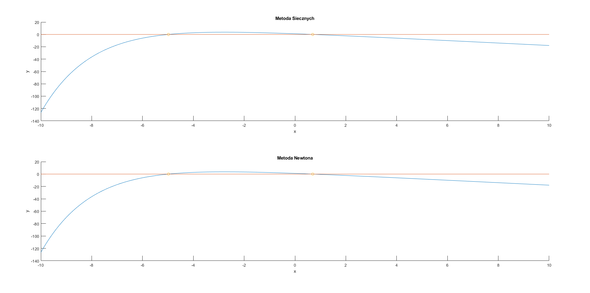

# Metody Numeryczne - Projekt II
```s
student: Bartłomiej Krawczyk
indeks: 310774
```
# Zadanie 1

## Treść

Proszę znaleźć wszystkie pierwiastki funkcji
$f(x) = 2.1 - 2x - e^{-x/2}$ w przedziale $[10, -10]$ używając dla każdego zera:

a) własnego solwera z implementacją metody **siecznych**

b) podanego na stronie przedmiotu solwera `newton.m` z implementacją metody Newtona

## Funkcja zadana

$$
f(x) = 2.1 - 2x - e^{-x/2}
$$

```matlab
function y = function1(x)
    y = 2.1 - 2 * x - exp(-x / 2);
end
```

## Rozwiązanie a)

W metodzie siecznych prowadzimy sieczną zawsze między dwoma ostatnio wyznaczonymi punktami. Nie dbamy przy tym o zachowanie przedziału izolacji pierwiastka.

W celu wyznaczenia kolejnego punktu wyznaczamy miejsce przecięcia siecznej z prostą $y=0$. Liczymy to korzystając z podobieństwa trójkątów prostokątnych:
$$
\frac{f(x_n) - f(x_{n-1})}{x_n - x_{n-1}} = \frac{f(x_n) - 0}{x_n - x_{n + 1}}
$$
wyznaczając $x_{n+1}$ otrzymujemy:
$$
x_{n+1} = x_n - \frac{f(x_n)(x_n - x_{n-1})}{f(x_n) - f(x_{n-1})} = \frac{x_{n-1}f(x_n) - x_n f(x_{n-1})}{f(x_n) - f(x_{n-1})}
$$

### Program

```matlab
function [xf, ff, iexe, texe] = secant(f, x, delta, imax)
    %
    %   CEL
    %       Poszukiwanie pierwiastka funkcji jednej zmiennej
    %       metoda siecznych
    %  
    %   PARAMETRY WEJSCIOWE
    %       f      -  funkcja dana jako wyrazenie  
    %       x      -  przedział początkowy
    %       delta  -  dokladnosc  
    %       imax   -  maksymalna liczba iteracji
    %
    %   PARAMETRY WYJSCIOWE
    %       xf     -  rozwiazanie 
    %       ff     -  wartosc funkcji w xf
    %       iexe   -  liczba iteracji wykonanych
    %       texe   -  czas obliczen [s]
    tic;
    i = 0;

    x0 = min(x);
    x1 = max(x);
    fx0 = feval(f,x0);
    fx1 = feval(f, x1);

    while abs(fx1) > delta && i < imax
         i = i + 1;
         [x0, fx0, x1, fx1] = nextVal(f, x0, fx0, x1, fx1);
    end

    texe = toc;
    iexe = i;
    
    xf = x1; 
    ff = fx1;
end

function [x0, fx0, x1, fx1] = nextVal(f, x0, fx0, x1, fx1)
    x = (x0 * fx1 - x1 * fx0) / (fx1 - fx0);

    x0 = x1;
    fx0 = fx1;
    x1 = x;
    fx1 = feval(f, x1);
end
```

## Rozwiązanie b)

Metoda Newtona (stycznych), aproksymuje funkcję korzystając z jej liniowego przybliżenia. Wylicza je poprzez ucięcie rozwinięcia w szereg Taylora w aktualnym punkcie $x_n$

$$
f(x) \approx f(x_n) + f'(x_n)(x - x_n)
$$

Kolejny punkt $x_{n+1}$ jest wyliczany z przyrównania do zera aproksymacji liniowej funkcji $f(x)$:

$$
f(x_n) + f'(x_n)(x_{n+1} - x_n) = 0
$$

wyznaczając $x_{n+1}$ otrzymujemy:

$$
x_{n+1} = x_n - \frac{f(x_n)}{f'(x_n)}
$$

### Program

```matlab
function [xf, ff, iexe, texe] = newton(f, x0, delta, imax)
    %
    %   CEL
    %       Poszukiwanie pierwiastka funkcji jednej zmiennej
    %       metoda Newtona (stycznych)
    %  
    %   PARAMETRY WEJSCIOWE
    %       f      -  funkcja dana jako wyrazenie  
    %       x0     -  punkt poczatkowy
    %       delta  -  dokladnosc  
    %       imax   -  maksymalna liczba iteracji
    %
    %   PARAMETRY WYJSCIOWE
    %       xf     -  rozwiazanie 
    %       ff     -  wartosc funkcji w xf
    %       iexe   -  liczba iteracji wykonanych
    %       texe   -  czas obliczen [s]
    %
    %   PRZYKLADOWE WYWOLANIE
    %       >> [xf, ff, iexe, texe] = newton(@ (x) sin(x), 2, 1e-8, 100)
    %
    syms X
    % obliczenie pochodnej reprezentowanej jako funkcja anonimowa
    df = matlabFunction(diff(f(X), X));
    tic;
    i = 0;
    x = x0;
    fx = feval(f,x);
    while abs(fx) > delta && i < imax
         i = i + 1;
         % iteracyjne obliczanie nowego przyblizenia pierwiastka
         x = x - fx/df(x);
         fx = feval(f, x);
    end
    texe = toc;
    iexe = i;
    
    xf = x; 
    ff = fx;
end
```

## Wyniki

### Program

```matlab
function plot_2_1()
    x = -10 : 0.1 : 10;
    f = @ (x) function1(x);
    delta = 1e-8;
    imax = 100;

    y = f(x);

    tiledlayout(2, 1);

    nexttile;
    hold on;
    title('Metoda Siecznych');
    xlabel('x');
    ylabel('y');
    plot(x, y);
    plot(x, zeros(length(x), 1));
    [xf, ff] = zerosSecant(f, [-10 : 1 : 0; 0 : 1 : 10]', delta, imax);
    scatter(xf, ff);
    hold off;

    fprintf('\n');

    nexttile;
    hold on;
    title('Metoda Newtona');
    xlabel('x');
    ylabel('y');
    plot(x, y);
    plot(x, zeros(length(x), 1));
    [xf, ff] = zerosNewton(f, -10 : 2 : 10, delta, imax);
    scatter(xf, ff);
    hold off;
end
```

### Wykres



### Metoda Siecznych

**Program**
```matlab
function [x, y] = zerosSecant(f, pp, delta, imax)
    [n, ~] = size(pp);

    x = zeros(n, 1);
    y = zeros(n, 1);

    fprintf('pp\t\t\t\t\t\t|\tf(pp)\t\t\t\t\t|\tpk\t\t\t|\tf(pk)\t\t\t|\tIterations\t|\tTime\n');
    fprintf('-\t\t\t\t\t\t|\t-\t\t\t\t\t\t|\t-\t\t\t|\t-\t\t\t\t|\t-\t\t\t|\t-\n');

    for i = 1 : n
        [xf, ff, iexe, texe] = secant(f, pp(i, :), delta, imax);
        x(i) = xf;
        y(i) = ff;

        fprintf('[%f, %f]\t|\t[%f, %f]\t|\t%f\t|\t%.10f\t|\t%.0f\t\t\t|\t%f s\t\n', ...
            [pp(i, 1), pp(i, 2), f(pp(i, 1)), f(pp(i, 2)), xf, ff, iexe, texe]);
    end
end
```

**Wynik**

| pp                     | f(pp)                   | pk        | f(pk)         | Iterations | Time       |
|------------------------|-------------------------|-----------|---------------|------------|------------|
| [-10.000000, 0.000000] | [-126.313159, 1.100000] | 0.697154  | -0.0000000008 | 5          | 0.000016 s |
| [-9.000000, 1.000000]  | [-69.917131, -0.506531] | 0.697154  | -0.0000000000 | 5          | 0.000009 s |
| [-8.000000, 2.000000]  | [-36.498150, -2.267879] | 0.697154  | -0.0000000090 | 5          | 0.000003 s |
| [-7.000000, 3.000000]  | [-17.015452, -4.123130] | 0.697154  | -0.0000000000 | 6          | 0.000003 s |
| [-6.000000, 4.000000]  | [-5.985537, -6.035335]  | NaN       | NaN           | 4          | 0.000002 s |
| [-5.000000, 5.000000]  | [-0.082494, -7.982085]  | -4.979683 | -0.0000000001 | 7          | 0.000003 s |
| [-4.000000, 6.000000]  | [2.710944, -9.949787]   | 0.697154  | 0.0000000000  | 7          | 0.000003 s |
| [-3.000000, 7.000000]  | [3.618311, -11.930197]  | 0.697154  | -0.0000000000 | 6          | 0.000003 s |
| [-2.000000, 8.000000]  | [3.381718, -13.918316]  | 0.697154  | -0.0000000000 | 6          | 0.000003 s |
| [-1.000000, 9.000000]  | [2.451279, -15.911109]  | 0.697154  | 0.0000000004  | 5          | 0.000002 s |
| [0.000000, 10.000000]  | [1.100000, -17.906738]  | 0.697154  | 0.0000000000  | 5          | 0.000002 s |

### Metoda Newtona

**Program**
```matlab
function [x, y] = zerosNewton(f, pp, delta, imax)
    n = length(pp);

    x = zeros(n, 1);
    y = zeros(n, 1);

    fprintf('pp\t\t\t|\tf(pp)\t\t|\tpk\t\t\t|\tf(pk)\t\t\t|\tIterations\t|\tTime\n');
    fprintf('-\t\t\t|\t-\t\t\t|\t-\t\t\t|\t-\t\t\t\t|\t-\t\t\t|\t-\n');

    for i = 1 : n
        [xf, ff, iexe, texe] = newton(f, pp(i), delta, imax);
        x(i) = xf;
        y(i) = ff;

        fprintf('%f\t|\t%f\t|\t%f\t|\t%.10f\t|\t%.0f\t\t\t|\t%f s\t\n', [pp(i), f(pp(i)), xf, ff, iexe, texe]);
    end
end
```

**Wynik**

| pp         | f(pp)       | pk        | f(pk)         | Iterations | Time       |
|------------|-------------|-----------|---------------|------------|------------|
| -10.000000 | -126.313159 | -4.979683 | -0.0000000005 | 7          | 0.000013 s |
| -8.000000  | -36.498150  | -4.979683 | -0.0000000000 | 6          | 0.000009 s |
| -6.000000  | -5.985537   | -4.979683 | -0.0000000000 | 5          | 0.000012 s |
| -4.000000  | 2.710944    | -4.979683 | -0.0000000001 | 5          | 0.000009 s |
| -2.000000  | 3.381718    | 0.697154  | -0.0000000000 | 5          | 0.000010 s |
| 0.000000   | 1.100000    | 0.697154  | -0.0000000004 | 3          | 0.000008 s |
| 2.000000   | -2.267879   | 0.697154  | -0.0000000021 | 3          | 0.000009 s |
| 4.000000   | -6.035335   | 0.697154  | -0.0000000000 | 4          | 0.000016 s |
| 6.000000   | -9.949787   | 0.697154  | -0.0000000000 | 4          | 0.000025 s |
| 8.000000   | -13.918316  | 0.697154  | -0.0000000000 | 4          | 0.000012 s |
| 10.000000  | -17.906738  | 0.697154  | -0.0000000000 | 4          | 0.000009 s |

### Komentarz

Obie metody poradziły sobie ze znalezieniem miejsc zerowych funkcji. Obie metody znalazły miejsce zerowe w podobnej liczbie iteracji. Metoda siecznych jest minimalnie szybsza jeśli chodzi o czas wykonania.

Metoda siecznych może zawieść gdy:
- wartości funkcji w kolejnych punktach są zbliżone - możliwe jest, że znacznie oddalimy się od początkowego przedziału - mianownik $f(x_n)-f(x_{n-1})$ będzie bliski 0
    - tak się dzieje np. w przypadku przyjęcia punktów początkowych [-6.000000, 4.000000], już w pierwszej iteracji algorytmu osiągamy $x_2 = -1.2080e+03$, znacznie oddalone od przyjętego przedziału, w kolejnych iteracjach osiągamy na zmianę $-1.2080e+03$ oraz $4$, aż obie wartości $x_n$ oraz $x_{n-1}$ są równe 4, wtedy dochodzimy do dzielenia przez $f(4) - f(4) = 0$, które zwraca wartość nie określoną Nan
- na przedziale testowanym w pewnym punkcie pochodna funkcji jest równa 0 - z tego samego powodu co wyżej

Metoda Newtona może zawieść gdy:
- stosujemy ją w punkcie zbytnio oddalonym od rozwiązania (poza obszarem atrakcji pierwiastka)
- w okolicy punktu testowanego pochodna funkcji jest równa 0 - jeśli trafimy w taki punktu, algorytm może znacznie oddalić się od pierwiastka funkcji


# Zadanie 2

## Treść

Używając metody **Müllera MM1** proszę znaleźć wszystkie pierwiastki wielomianu czwartego stopnia:

$$
f(x) = a_4x^4 + a_3x^3 + a_2x^2 + a_1x + a_0
$$


$$
\begin{bmatrix}
a_4 & a_3 & a_2 & a_1 & a_0\\
\end{bmatrix}
=
\begin{bmatrix}
-1 & 1.5 & 1.5 & 0.5 & 1\\
\end{bmatrix}
$$

## Rozwiązanie

## Metoda Müllera MM1

W celu znalezienia pierwiastka funkcji korzystamy z przybliżenia z wykorzystaniem funkcji kwadratowej, której parametry są wyznaczane ze wzorów:

$$
a = q f(x_2) - q(1 + q)f(x_1) + q^2 f(x_0)
$$

$$
b = (2q + 1)f(x_2) - (1+q)^2 f(x_1) + q^2 f(x_0)
$$

$$
c = (q + 1) f(x_2)
$$

gdzie

$$
q = \frac{x_2 - x_1}{x_1 - x_0}
$$

Kolejne iteracje bazują na trzech ostatnich punktach: $x_0, x_1, x_2$. Gdzie zakładamy, że $x_2$ to ostatnie przybliżenie pierwiastka $\alpha$.

Przez te trzy punkty prowadzimy parabolę, a do kolejnego przybliżenia $\alpha$ bierzemy pierwiastek paraboli o mniejszym module:

$$
x_3 = x_2 + z_{min}
$$

gdzie $z_{min}$ wyliczamy:

$$
\begin{equation}
  z_{min} =  \begin{cases}
    \frac{-2c}{b+\sqrt{b^2-4ac}}, & \text{dla $|b+\sqrt{b^2-4ac}|\ge |b-\sqrt{b^2-4ac}|$}\\
    \frac{-2c}{b-\sqrt{b^2-4ac}}, & \text{w pozostałych przypadkach}
  \end{cases}
\end{equation}
$$

W kolejnej iteracji odrzucamy spośród $x_0, x_1, x_2$ punkt położony najdalej od ostatnio wyznaczonego przybliżenia $x_3$.

**Program**


### Deflacja czynnikiem liniowym z wykorzystaniem schematu Hornera

Jesteśmy w stanie zapisać wielomian w postaci iloczynu $(x-\alpha)$ oraz pewnej funkcji $Q(x)$, która jest wielomianem o stopień niższym niż funkcja $f(x)$. 
$$
f(x) = a_n x^n + a_{n-1} x^{n-1} + ... + a_1 x + a_0 = (x - \alpha)Q(x)
$$

Gdzie $\alpha$ to pierwiastek funkcji $f(x)$, a $Q(x)$:
$$
Q(x) = q_n x^{n-1} + ... + q_2 x + q_1
$$

Wyznaczamy $Q(x)$ korzystając ze schematu Hornera:

$$
q_{n+1} \stackrel{def}{=} 0
$$

$$
q_{i} = a_i + q_{i+1}\alpha \\
 \text{gdzie} \\ i = 0, 1, ..., n - 1
$$

Następnie jesteśmy w stanie dalej liczyć pierwiastki funkcji $Q(x)$, które będą również pierwiastkami funkcji $f(x)$. Postępujemy tak do osiągnięcia wszystkich pierwiastków, za każdym razem wyliczając pierwiastki dla wielomianu niższego stopnia.

**Program**