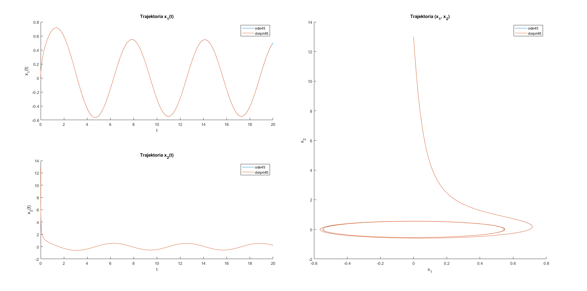
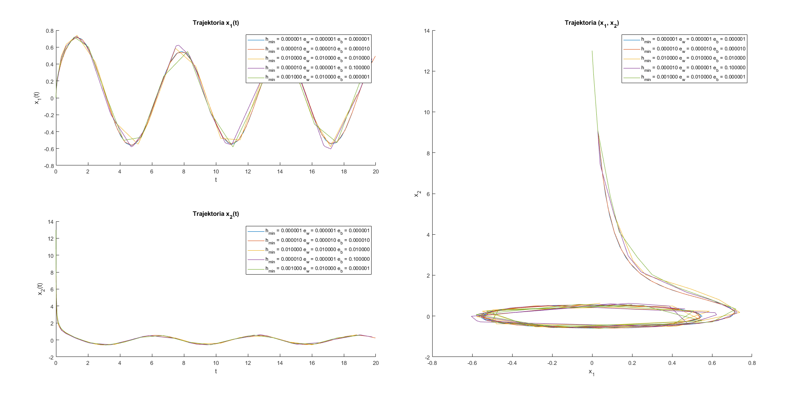
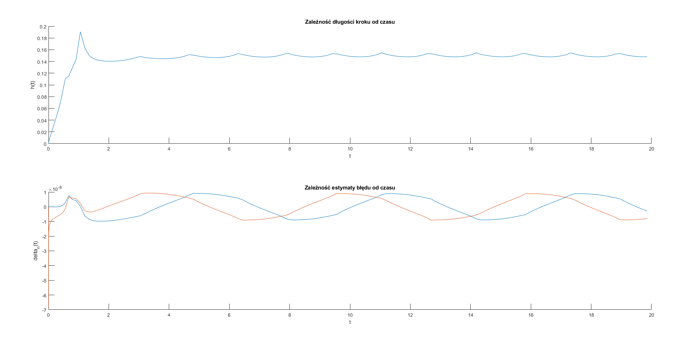

# Metody Numeryczne - Projekt III
```s
student: Bartłomiej Krawczyk
indeks: 310774
```
# Zadanie 1

## Treść

Ruch punktu na płaszczyźnie ($x_1$, $x_2$) jest opisany równaniami:

$$
\frac{dx_1}{dt} = x_2 + x_1 (0.3 - x_1^2 - x_2^2)
$$

$$
\frac{dx_1}{dt} = - x_1 + x_2  (0.3 - x_1^2 - x_2^2)
$$

Należy obliczyć przebieg trajektorii ruchu tego punktu w przedziale [0, 20] dla warunków początkowych: $x_1(0) = 0$, $x_2(0) = 13$.

Rozwiązanie proszę znaleźć korzystając z zaimplementowanej przez siebie w języku Matlaba w formie funkcji (możliwie uniwersalnej, czyli solwera, o odpowiednich parametrach wejścia i wyjścia) metody Dormand-Prince'a czwartego rzędu przy zmiennym kroku z szacowaniem błędu techniką pary metod włożonych (DorPri45).

### Równania trajektorii

```matlab
function dxdt = trajectory(t, x)
    dx1dt = x(2) + x(1) * (0.3 - x(1)^2 - x(2)^2);
    dx2dt = -x(1) + x(2) * (0.3 - x(1)^2 - x(2)^2);

    dxdt = [dx1dt; dx2dt];
end
```

## Opis algorytmu

### Metoda Dormand-Prince'a

Metoda Dormand-Prince'a bierze pod uwagę parę metod włożonych - dwie metody Rungego-Kutty - 4 oraz 5 rzędu.

- Metoda RK rzędu 4 (6 etapowa):
$$
x_{n+1} = x_n + h \sum_{i=1}^6 w_i^* k_i
$$
$$
k_1 = f(t_n, x_n)
$$
$$
k_i = f(t_n + c_i h, x_n + h  \sum_{j=1}^{i-1} a_{ij}k_j), \text{dla i=2,3,...6}
$$

- Metoda RK rzędu 5 (7 etapowa):
$$
x_{n+1} = x_n + h \sum_{i=1}^{7} w_i^* k_i
$$
$$
k_1 = f(t_n, x_n)
$$
$$
k_i = f(t_n + c_i h, x_n + h  \sum_{j=1}^{i-1} a_{ij}k_j), \text{dla i=2,3,...7}
$$

W obu metodach współczynniki $w_i^*$ i $w_i$ są różne, ale równe są współczynniki $c_i$ oraz $a_{ij}$.

$$
C = \begin{bmatrix}
0 & 1/5 & 3/10 & 4/5 & 8/9 & 1 & 1 \\
\end{bmatrix}
$$

$$
A = \begin{bmatrix}
0 & 0 &     0 &     0 &     0 &     0 \\
1/5 & 0 &     0 &     0 &     0 &     0 \\
3/40 &  9/4 &   0 &     0 &     0 &     0 \\
44/45 & -56/15  &  32/9 &  0 &     0 &     0 \\
19372/6561 & -25360/2187 & 64448/6561 & -212/729 & 0 &  0 \\
9017/3168 &  -355/33 &  46732/5247 & 49/176 & -5103/18656 & 0 \\
35/384 & 0 &  500/1113 & 125/192 &  -2187/6784 & 11/84 \\
\end{bmatrix}
$$

$$
W^* = \begin{bmatrix}
35/384 & 0 & 500/1113 & 125/192 & -2187/6784 & 11/84 \\
\end{bmatrix}
$$

$$
W = \begin{bmatrix}
5179/57600 & 0 & 7571/16695 & 393/640 & -92097/339200 & 187/2100 & 1/40 \\
\end{bmatrix}
$$

Dzięki temu współczynniki $k_i$ w obu przypadkach są wyliczane ze wzorów:

$$
k_{1} = h f(t_{n}, x_{n})
$$

$$
k_{2} = h f(t_{n}+\frac{1}{5} h, x_{n}+\frac{1}{5} k_{1})
$$

$$
k_{3} = h f(t_{n}+\frac{3}{10} h, x_{n}+\frac{3}{40} k_{1}+\frac{9}{40} k_{2})
$$

$$
k_{4} = h f(t_{n}+\frac{4}{5} h, x_{n}+\frac{44}{45} k_{1}-\frac{56}{15} k_{2}+\frac{32}{9} k_{3})
$$

$$
k_{5} = h f(t_{n}+\frac{8}{9} h, x_{n}+\frac{19372}{6561} k_{1}-\frac{25360}{2187} k_{2}+\frac{64448}{6561} k_{3}-\frac{212}{729} k_{4})
$$

$$
k_{6} = h f(t_{n}+h, x_{n}+\frac{9017}{3168} k_{1}-\frac{355}{33} k_{2}-\frac{46732}{5247} k_{3}+\frac{49}{176} k_{4}-\frac{5103}{18656} k_{5})
$$

$$
k_{7} = h f(t_{n}+h, x_{n}+\frac{35}{384} k_{1}+\frac{500}{1113} k_{3}+\frac{125}{192} k_{4}-\frac{2187}{6784} k_{5}+\frac{11}{84} k_{6})
$$

Wartość w kolejnym kroku metody RK rzędu 4 jest wyliczana jako:

$$
x_{n+1}=x_{n}+\frac{35}{384} k_{1}+\frac{500}{1113} k_{3}+\frac{125}{192} k_{4}-\frac{2187}{6784} k_{5}+\frac{11}{84} k_{6}
$$

Następnie wyliczamy wartość w kolejnym punkcie z wykorzystaniem metody RK rzędu 5:

$$
z_{n+1}=x_{n}+\frac{5179}{57600} k_{1}+\frac{7571}{16695} k_{3}+\frac{393}{640} k_{4}-\frac{92097}{339200} k_{5}+\frac{187}{2100} k_{6}+\frac{1}{40} k_{7}
$$


Po odjęciu stronami powyższych równań otrzymujemy oszacowanie błędu metody rzędu 4:

$$
\delta_n(h)=h(z_{n+1}-x_{n+1})=h*(-\frac{71}{57600} k_{1}(h)+\frac{71}{16695} k_{3}(h)-\frac{71}{1920} k_{4}(h)+\frac{17253}{339200} k_{5}(h)-\frac{22}{525} k_{6}(h)+\frac{1}{40} k_{7}(h))
$$

**Program:**

```matlab
function [x2, delta] = nextValue(f, t, x1, h)
    k1 = h * f(t, x1);
    k2 = h * f(t + 1/5 * h,     x1 + 1/5 * k1);
    k3 = h * f(t + 3/10 * h,    x1 + 3/40 * k1          + 9/40 * k2);
    k4 = h * f(t + 4/5 * h,     x1 + 44/45 * k1         - 56/15 * k2        + 32/9 * k3);
    k5 = h * f(t + 8/9 * h,     x1 + 19372/6561 * k1    - 25360/2187 * k2   + 64448/6561 * k3   - 212/729 * k4);
    k6 = h * f(t + h,           x1 + 9017/3168 * k1     - 355/33 * k2       + 46732/5247 * k3   + 49/176 * k4       - 5103/18656 * k5);
    k7 = h * f(t + h,           x1 + 35/384 * k1                            + 500/1113 * k3     + 125/192 * k4      - 2187/6784 * k5    + 11/84 * k6);

    x2 = x1 + 35/384 * k1 + 500/1113 * k3 + 125/192 * k4 - 2187/6784 * k5 + 11/84 * k6;
    delta = h * (-71/57600 * k1 + 71/16695 * k3 - 71/1920 * k4 + 17253/339200 * k5 - 22/525 * k6 + 1/40 * k7);
end
```

### Wyznaczanie zmienionej długości kroku

W trakcie wyznaczania kolejnego kroku $h_{n+1}$ bierze się pod uwagę niedokładności oszacowania błędu, a także stosuje się współczynnik bezpieczeństwa $s$:

$$
h_{n+1} = s \alpha h_n, \text{ gdzie s < 1}
$$

dla metody Dormand-Prince'a przyjmę $s \approx 0.9$, a współczynnik modyfikacji kroku $\alpha$ wylicza się ze wzoru:

$$
\alpha = (\frac{\varepsilon}{|\delta_n(h)|})^{\frac{1}{5}}
$$

gdzie:

$$
\varepsilon = |x_n| \varepsilon_w + \varepsilon_b \\
\varepsilon_w \text{ - dokładność względna} \\
\varepsilon_b \text{ - dokładność bezwzględna}
$$

**Uwaga:** Jako, że w książce nie było sprecyzowane w jaki sposób należy traktować wartość bezwględną w przypadku wektora $\delta_n(h)$ lub $x_n$ to założyłem, że skorzystam z normy Euklidesowej dla wektorów, która w przypadku liczb jest równa wartości bezwzględnej z tej liczby.

**Program:**

```matlab
function alpha = calculateAlpha(x, epsilonW, epsilonB, delta)
    epsilon = norm(x) * epsilonW + epsilonB;

    alpha = (epsilon / norm(delta))^(1/5);
end
```

## Podstawowa realizacja metod RK oraz RKF

**Program**
```matlab
function [tout, xout, hout, dout] = dorpri45(dxdt, tspan, x0, h0, hmin, epsilonW, epsilonB)
    %
    %   CEL
    %       Wyznaczanie rozwiązania układu równań różniczkowych zwyczajnych
    %       przy podanej wartości rozwiązania w punkcie początkowym
    %  
    %   PARAMETRY WEJSCIOWE
    %       dxdt   -  funkcja przyjmująca jako parametry czas oraz wartości
    %                 w punkcie, a zwracająca pochodną dx/dt 
    %       t0     -  wektor dwu wartościowy - przedział poszukiwania
    %                 rozwiązania
    %       x0     -  wektor punktów startowych  
    %       h0     -  początkowa wartość kroku
    %       hmin   -  ustalona minimalna wielkość kroku - poniżej tego
    %                 kroku kończymy program - uznajemy, że nie da się
    %                 znaleźć wyniku z zadaną dokładnością
    %       epsilonW - wartość dozwolonego błędu względnego
    %       epsilonB - wartość dozwolonego błędu bezwzględnego
    %
    %   PARAMETRY WYJSCIOWE
    %       tout   -  wektor kolejnych wartości czasu t 
    %       xout   -  macierz kolejnych wartości x w kolejnych iteracjach
    %                 algorytmu
    %       hout   -  wektor kroków w kolejnych iteracjach algorytmu
    %       dout   -  macierz szacowanych błędów dla wartości x w kolejnych
    %                 iteracjach algorytmu
    %
    %   PRZYKLADOWE WYWOLANIE
    %       >> [tout, xout, hout, dout] = dorpri45(@trajectory, [0 20], [0; 13], 1e-4, 1e-6, 1e-8, 1e-8)
    %
    s = 0.9;

    x1 = x0;
    t1 = tspan(1);
    tmax = tspan(2);
    h1 = h0;

    tout = t1;
    xout = x1';
    hout = h1;
    dout = [0 0];
    n = 1;

    while true
        [x2, delta] = nextValue(dxdt, t1, x1, h1);
        alpha = calculateAlpha(x1, epsilonW, epsilonB, delta);

        salpha = s * alpha;
        h2prop = salpha * h1;

        if salpha >= 1
            if t1 + h1 >= tmax
                % osiągnięty koniec przedziału -> kończymy program
                return;
            else
                % aktualizacja wartości funkcji w kolejnych krokach
                t2 = t1 + h1;
                % stosuję heurystyczne ograniczenie maksymalnego wzrostu
                % długości kroku h_n w jednej iteracji do wartości co
                % najwyżej \beta h_n
                h2 = min([h2prop, 5 * h1, tmax - t1]);
                n = n + 1;

                tout(n, 1) = t2;
                xout(n, :) = x2';
                hout(n, 1) = h2;
                dout(n, :) = delta';

                t1 = t2;
                x1 = x2;
                h1 = h2;
            end
        else
            % w tej iteracji krok był za duży, należy zminiejszyć krok
            if h2prop < hmin
                % osiągnięty krok jest mniejszy niż zadany najmniejszy krok
                disp("Niemożliwe rozwiązanie z zadaną dokładnością");
                return;
            else
                % zmniejszenie kroku
                h1 = h2prop;
            end
        end
    end
end
```

## Porównanie rozwiązania z wykorzystaniem solwera ode45 Matlaba

**Wykres**



**Ilość iteracji**

| function | iterations |
|----------|------------|
| ode45    | 169        |
| dorpri45 | 160        |

**Porównanie czasu**
```
ode45:
Elapsed time is 0.001873 seconds.
dorpri45:
Elapsed time is 0.002709 seconds.
```

**Komentarz:**

- dla przyjętych parametrów ($h_{min}, \varepsilon_w, \varepsilon_b$) rozwiązania praktycznie się nie różnią
- tak się, złożyło, że z danymi parametrami moja implementacja osiąga rozwiązanie w mniejszej ilości iteracji lecz trochę dłuższym czasie

**Program:**

```matlab
function plot_3_1()
    x0_1 = 0;
    x0_2 = 13;
    x0 = [x0_1; x0_2];
    time_span = [0 20];
    h0 = 1e-4;
    hmin = 1e-6;
    epsilonW = 1e-8;
    epsilonB = 1e-8;

    disp("ode45:");
    tic;
    [tode, xode] = ode45(@trajectory, time_span, x0);
    toc
    disp("dorpri45:");
    tic;
    [tdp, xdp, ~, ~] = dorpri45(@trajectory, time_span, x0, h0, hmin, epsilonW, epsilonB);
    toc

    fprintf('function\t|\titerations\n');
    fprintf('-\t\t\t|\t-\n');
    todesize = size(tode);
    tdpsize = size(tdp);
    fprintf('ode45\t\t|\t%0.f\n', [todesize(1)]);
    fprintf('dorpri45\t|\t%0.f\n', [tdpsize(1)]);

    tiledlayout(2, 2);
    
    % Trajektoria x_1(t)
    nexttile;
    hold on;
    title('Trajektoria x_1(t)');
    xlabel('t');
    ylabel('x_1(t)');
    plot(tode, xode(:, 1));
    plot(tdp, xdp(:, 1));
    legend('ode45', 'dorpri45');
    hold off;

    % Trajektoria na płaszczyźnie (x_1, x_2)
    nexttile([2, 1]);
    hold on;
    title('Trajektoria (x_1, x_2)');
    xlabel('x_1');
    ylabel('x_2');
    plot(xode(:, 1), xode(:, 2));
    plot(xdp(:, 1), xdp(:, 2));
    legend('ode45', 'dorpri45');
    hold off;

    % Trajektoria x_2(t)
    nexttile;
    hold on;
    title('Trajektoria x_2(t)');
    xlabel('t');
    ylabel('x_2(t)');
    plot(tode, xode(:, 2));
    plot(tdp, xdp(:, 2));
    legend('ode45', 'dorpri45');
    hold off;
end
```

## Rozwiązanie z różnymi parametrami minimalnego kroku, dokładności względnej oraz bezwzględnej



**Ilość iteracji**

| h_{min}  | e_w      | e_b      | iterations |
|----------|----------|----------|------------|
| 0.000001 | 0.000001 | 0.000001 | 78         |
| 0.000010 | 0.000010 | 0.000010 | 56         |
| 0.010000 | 0.010000 | 0.010000 | 25         |
| 0.000010 | 0.000001 | 0.100000 | 54         |
| 0.001000 | 0.100000 | 0.000001 | 37         |

**Komentarz:**

Minimalny krok $h_{min}$:
- ustala w jakich minimalnych odstępach należy ustalać kolejne wartości funkcji
- jeśli jest przekroczone algorytm kończy działanie z błędem
- jest wykorzystywane w momencie gdy utyka w pewnym momencie i jedynie są zmniejszane kroki

Dokładność względna:
- ustala na jak duży błąd między rzeczywistym rozwiązaniem a ustalonym pozwalamy
- jest zależna od wartości funkcji w danym punkcie
- dla dużych wartości przeważa dokładność względna nad bezwzględną

Dokładność bezwzględna:
- ustala na jak duży błąd między rzeczywistym rozwiązaniem a ustalonym pozwalamy
- dla wartości zbliżonych do 0 to dokładność bezwzględna ma większe znaczenie

**Program:**
```matlab
function plot_3_3()
    x0_1 = 0;
    x0_2 = 13;
    x0 = [x0_1; x0_2];
    time_span = [0 20];

    parameters = [
        1e-6    1e-6    1e-6
        1e-5    1e-5    1e-5
        1e-2    1e-2    1e-2
        1e-5    1e-6    1e-1
        1e-3    1e-1    1e-6
    ];

    [n, ~] = size(parameters);

    ts = {};
    xs = {};
    hs = {};
    ds = {};
    legends = {};
    fprintf('h_{min}\t\t|\te_w\t\t\t|\te_b\t\t\t|\titerations\n');
    fprintf('-\t\t\t|\t-\t\t\t|\t-\t\t\t|\t-\n');
    for i = 1 : n
        [tdp, xdp, hdp, ddp] = dorpri45(@trajectory, time_span, x0, 1e-4, parameters(i, 1), parameters(i, 2), parameters(i, 3));
        ts{i} = tdp;
        xs{i} = xdp;
        hs{i} = hdp;
        ds{i} = ddp;
        legends{i} = sprintf('h_{min} = %f e_w = %f e_b = %f', [parameters(i, 1), parameters(i, 2), parameters(i, 3)]);
        tsize = size(tdp);
        fprintf('%f\t|\t%f\t|\t%f\t|\t%0.f\n', [parameters(i, 1), parameters(i, 2), parameters(i, 3), tsize(1)]);
    end


    tiledlayout(2, 2);
    
    % Trajektoria x_1(t)
    nexttile;
    hold on;
    title('Trajektoria x_1(t)');
    xlabel('t');
    ylabel('x_1(t)');
    for i = 1 : n
        plot(ts{i}, xs{i}(:, 1));
    end
    legend(legends);
    hold off;

    % Trajektoria na płaszczyźnie (x_1, x_2)
    nexttile([2, 1]);
    hold on;
    title('Trajektoria (x_1, x_2)');
    xlabel('x_1');
    ylabel('x_2');
    for i = 1 : n
        plot(xs{i}(:, 1), xs{i}(:, 2));
    end
    legend(legends);
    hold off;

    % Trajektoria x_2(t)
    nexttile;
    hold on;
    title('Trajektoria x_2(t)');
    xlabel('t');
    ylabel('x_2(t)');
    for i = 1 : n
        plot(ts{i}, xs{i}(:, 2));
    end
    legend(legends);
    hold off;
end
```

## Wykresy



**Komentarz:**
- algorytm wystartował z niewielkim zadanym krokiem
- początkowo krok szybko się zwiększa
- po kilku iteracjach krok w czasie się stabilizuje i pozostaje na poziomie około 0.15
- szacowane błędy rozwiązań oscylują w okolicy 0

**Program:**
```matlab
function plot_3_2()
    x0_1 = 0;
    x0_2 = 13;
    x0 = [x0_1; x0_2];
    time_span = [0 20];
    h0 = 1e-4;
    hmin = 1e-6;
    epsilonW = 1e-8;
    epsilonB = 1e-8;


    [tdp, ~, hdp, ddp] = dorpri45(@trajectory, time_span, x0, h0, hmin, epsilonW, epsilonB);
    
    tiledlayout(2, 1);
    
    % Zależność długości kroku od czasu
    nexttile;
    hold on;
    title('Zależność długości kroku od czasu');
    xlabel('t');
    ylabel('h(t)');
    plot(tdp, hdp);
    hold off;

    % Zależność estymaty błędu od czasu
    nexttile;
    hold on;
    title('Zależność estymaty błędu od czasu');
    xlabel('t');
    ylabel('delta_n(t)');
    plot(tdp, ddp(:, 1));
    plot(tdp, ddp(:, 2));
    hold off;
end
```

## Wnioski

**Ocena poprawności wyników**

Wyniki obu metod zwracają zbliżone rezultaty. Na pierwszym wykresie przebiegi praktycznie się pokrywają.

**Ocena efektywności algorytmów**

Obie metody znalazły rozwiązanie w stosunkowo niewielkiej ilości kroków.

**Która metoda lepsza?**

Obie metody poradziły sobie bardzo dobrze z obliczaniem przebiegu trajektorii.

**Która metoda szybsza?**

Obie metody korzystając z implementacji metody Dormand-Prince'a. Metoda matlaba jest zoptymalizowana pod ten język przez co czas wykonania jest nieco krótszy.

Ilość iteracji mojej implementacji jest bardzo zależna od parametrów wejściowych. Dla przyjętych parametrów moja implementacja za każdym razem korzystała z mniejszej ilości iteracji niż metoda matlaba `ode45`.
